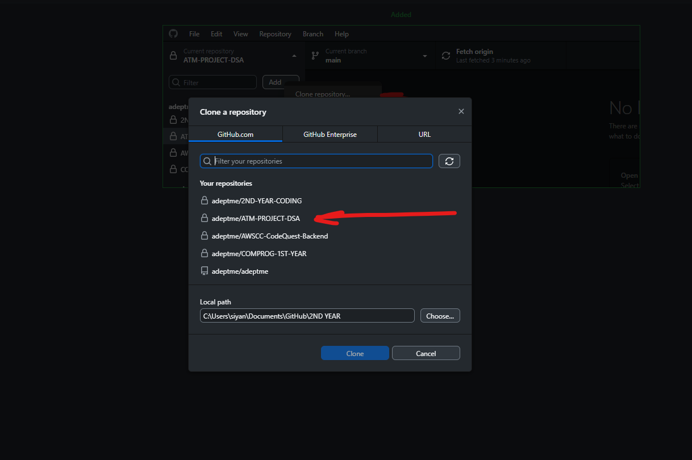
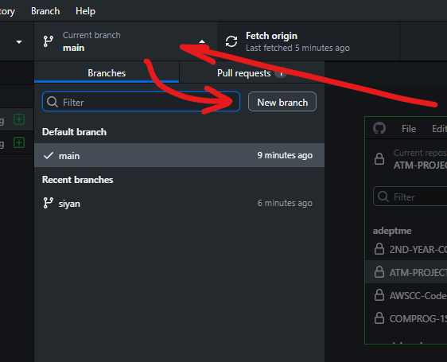
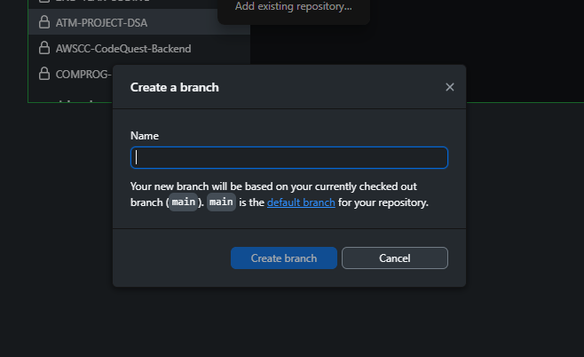
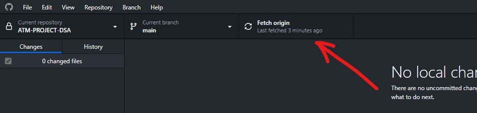
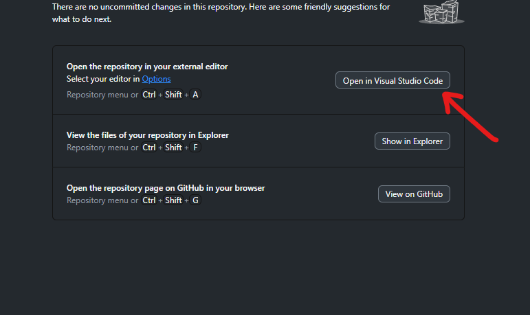
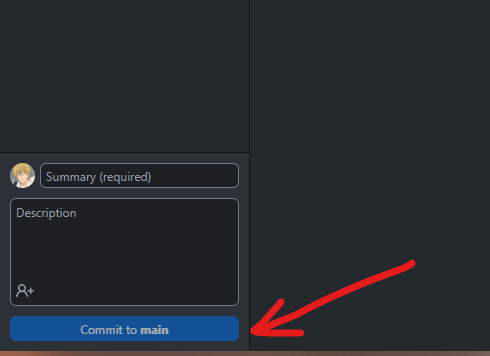
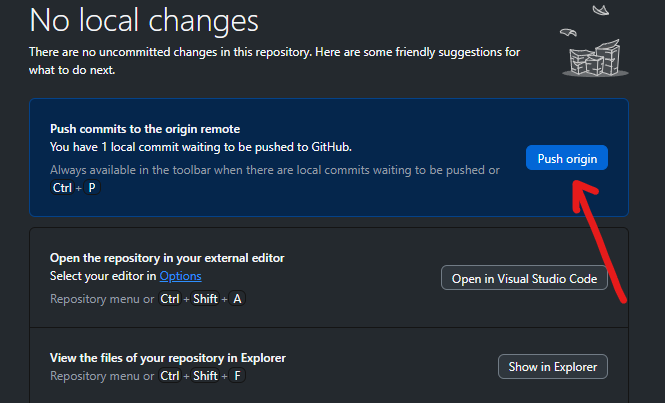
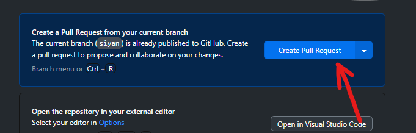
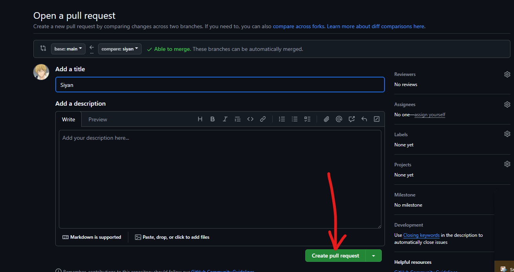

<h1 align="center">🖥️ATM MACHINE PROJECT in DSA💳</h1>

🧑‍💻 Developers: 
- Sean Lucino
- Ralf Neis
- Neo Gariando
- Raphael Espiritu
 ---
This project is a Automated Teller Machine built in **C++ Language** which instead of using an **ATM CARD**, it will use a *flash drive*.

 </a> 

---

&nbsp;There will be **two modules** built which are the process of creating an account and for usual ATM transaction processes such as **Balance Inquiry, Withdraw Cash, Bank Transfer, etc.**.
This repository will be used as a storage for source codes and a database for the accounts that will be created or registered.

The repository will contain the following:
- **transaction module** - source code for ATM transaction processes
- **registration module** - source code for ATM account creation
- **database file** - file containing accounts pushed into the repository
  
---

<h2 align="left" > Github Collaboration: </h2>
Must have:
- VS CODE (back-end)
- Visual Studio 2022 (front-end)
- GitHub Account
- GitHub Desktop Application

<h3 align="left" > 1. Cloning Repository from Github Website to your own PC </h3>
    
Click the current repository in the top-right corner of the interface and click <b>add</b> then <b>Clone Repository</b>.

     </a> 
    
Choose the repository <b>ATM-PROJECT-DSA</b>.

     </a> 

<h3 align="left" > 2. Creating your own branch </h3>
    
Click <b>current branch tab</b> beside the <b>current repository tab</b>.

     </a> 
    
Click <b>New Branch<b> and name your branch.

     </a> 
    <h4><b>Creating branch will avoid committing any direct changes into the main branch or files.</b></h4>

<h3 align="left" > 3. Fetching origin from GitHub to your PC </h3>
    <h4>This step should always be done before making any changes to any files to make sure you have the <b>latest files of the repository.</b></h4>
    
Click <b>Fetch Origin</b> beside the branch tab.

     </a> 
    
Open the repository in Visual Studio Code.

     </a> 
    <h4><b>You can now start coding!</b></h4>

<h3 align="left" > 4. Open your repository </h3>
    
Click <b>open in Visual Studio Code</b>.

     </a> 

<h3 align="left" > 5. Pulling files to the repository </h3>
    <h4>Committing and pushing files to the repositories are basically uploading the file to the repository. This is the most important step after you finished working.</h4>
    
Firstly, write a summary of your changes. It can be anything like simple title of your work or a letter.

     </a> 
    
<i>Make sure that you committing to your branch.</i>

    
Then, click <b>push origin</b> and <b>create pull request</b>.
     </a> 
     </a> 
    
then wait for the owner to accept your pull request for merging.

     </a> 
    <h1 align='center'>Good Luck!~</h1>
    

